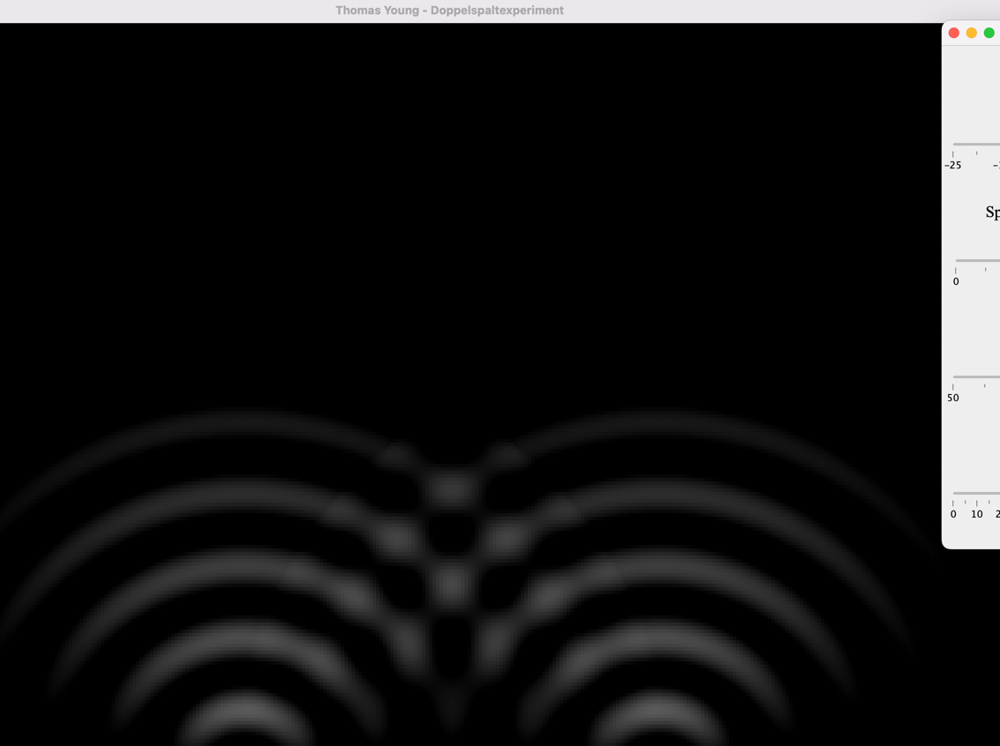

# Double Slit Experiment Visualisation
This visualisation shows the results of the famous double slit experiment, which demonstrates wave-like behaviour of light. The experiment was first proposed by Thomas Young in 1801 and has been studied extensively since then.

The visualization displays the interference pattern created when light passes through a pair of slits and strikes a screen. The two beams interfere with each other, producing peaks and troughs in the pattern. The height of the peaks and troughs is determined by the intensity of the light and the distance between the slits.

This visualisation makes it easy to understand the results of this experiment and to explore the effects of changing different parameters. The slits can be adjusted by dragging the sliders and the light intensity can be changed by using the slider.

# Equations & Formulas
This visualisation uses the following equations to calculate the interference pattern:

Wave Equation:
```
Z = A * cos(π * x / λ)
```
Where:
+ A is the amplitude,
+ λ is the wavelength of the light,

Calculation of light intensity:
```
I = I_max * cos^2(β) * (sin(α)/α)^2
```
Where:

+ I: Light intensity
+ I_max: Maximum light intensity
+ β: Angle of incidence
+ α: Angle of divergence

The formula for calculating the light intensity is based on the Lambert Cosine Law, 
which states that light intensity is proportional to the cosine of the angle of incidence (β), 
and inversely proportional to the square of the angle of divergence (α). 

The ```cos^2(β)``` term represents the intensity of the light in relation to the angle of incidence, 
while the ```(sin(α)/α)^2``` term accounts for the decrease in intensity due to the angle of divergence.

The following assumptions are made:
+ The light is monochromatic,
+ The gap between the slits is much less than the gap between the slits and the screen, 
+ The wavelength of the light used is small relative to the distance between the slits.

# Features
This visualisation contains the following features:
+ Drag the sliders to adjust the light intensity, position of slits, wavelength and wave decay.
+ Real time display of interference pattern.

